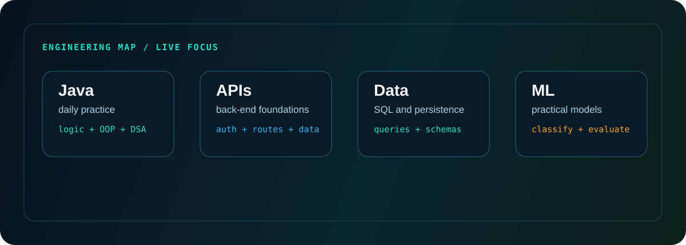

# Aljun Cursiga

**Computer Science student building toward software engineering**

## About me

I am a Computer Science student from the Philippines focused on becoming a software engineer. My strongest routine right now is practicing Java every day while strengthening the fundamentals behind clean program structure, back-end logic, REST APIs, authentication flow, data handling, and practical debugging.

I also build with web, mobile, database, and machine learning tools. The common thread is simple: I like turning real workflows into software that people can actually use, then improving the implementation until the behavior is understandable and reliable.

## Current direction

| Track | What I am sharpening |
| --- | --- |
| Java fundamentals | OOP, data structures, algorithms, problem solving, clean console and app logic |
| Back-end foundations | REST API concepts, validation, cookies, sessions, JWT basics, protected routes |
| Data layer | SQL, MySQL/MariaDB, PostgreSQL basics, Supabase basics, queries and schemas |
| Applied ML | Preprocessing, classification, model evaluation, and practical ML prototypes |

## Practice signal

## Selected work

| Project | Stack | What it shows |
| --- | --- | --- |
| **Database Monster Cert Prep** | Next.js, TypeScript, Python, Flask, SQL | Full practice system with public site, CLI, dashboard, scoring flow, and SQL review content. |
| **SpamGuard** | Python, Flask, scikit-learn, Naive Bayes | Text preprocessing, model training, evaluation, and a Flask interface for SMS/forum spam detection. |
| **Skin Cancer Detector** | Python, TensorFlow, Keras, CNN | Image classification workflow with preprocessing, augmentation, and accuracy/validation evaluation. |
| **Hospital Epidemic Surge Simulator** | Python, SimPy, Tkinter, Matplotlib, NumPy | Discrete-event simulation for patient arrivals, triage, bed allocation, staff use, outcomes, and visualization. |
| **BuhayLink** | Flutter, Dart, Firebase, Provider | Mobile app flows for account creation, job posting, browsing, and applications. |
| **Hontoria Printing Website** | PHP, JavaScript, SQL, MVC-style structure | Business pages with responsive layout, form handling, database interaction, and CSRF protection basics. |
| **COPS Interpol Website** | React, Vite, TypeScript, Mock API | Responsive organization site with reusable UI components, structured sections, and mock API/data flows. |

## Toolbox

**Core languages**

**Back-end and API foundations**

**Web and mobile**

**Databases and data**

