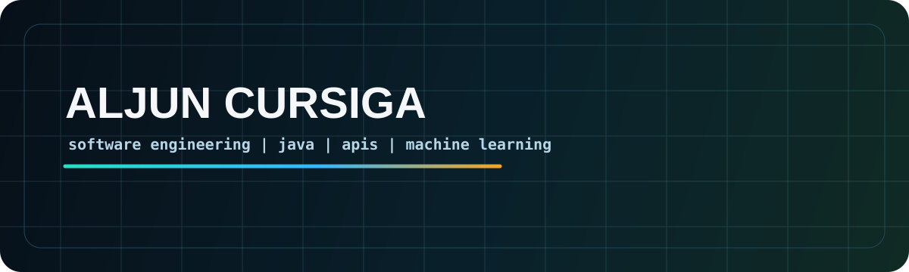

# Aljun Cursiga

**Computer Science student building toward software engineering**

## About me

I am a Computer Science student from the Philippines focused on becoming a software engineer. My strongest routine right now is practicing Java every day while strengthening the fundamentals behind clean program structure, back-end logic, REST APIs, authentication flow, data handling, and practical debugging.

I also build with web, mobile, database, and machine learning tools. The common thread is simple: I like turning real workflows into software that people can actually use, then improving the implementation until the behavior is understandable and reliable.
